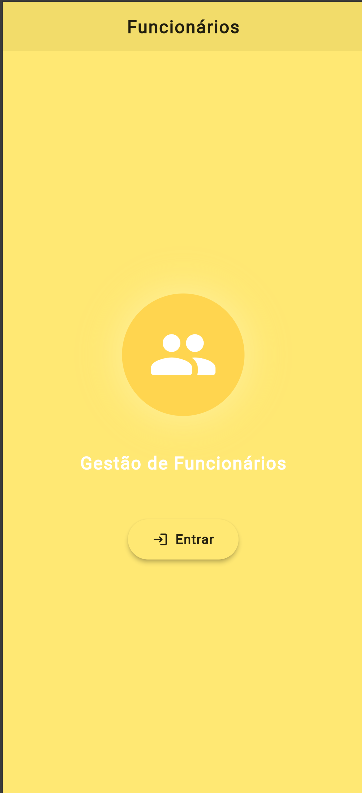
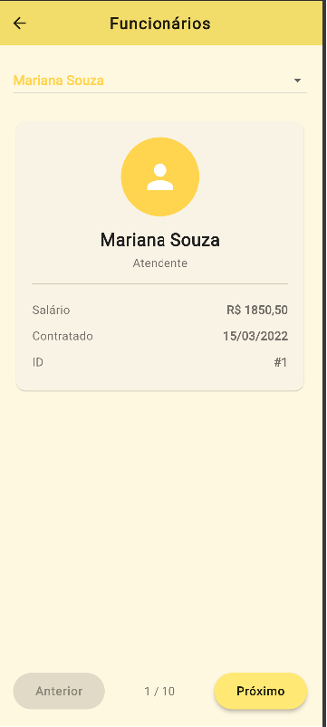
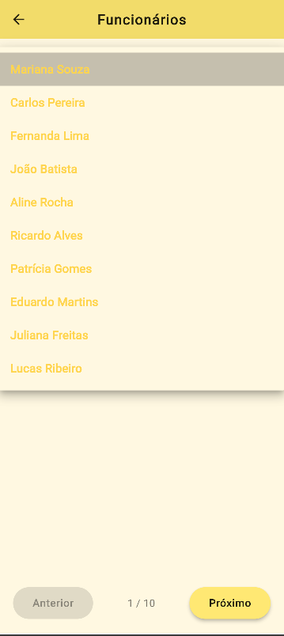

 ## Flutter Funcionários  
Flutter • Dart 

Aplicativo Flutter que exibe uma lista de funcionários carregados via JSON local, com navegação entre perfis, Splash Screen animada e interface personalizada.

---

### 🚀 Demonstração  
App desenvolvido como atividade acadêmica para praticar Flutter, animações e manipulação de JSON.

---

### ✨ Funcionalidades

📄 Leitura de JSON local (`assets/mockup/funcionario.json`)  
🧑‍💼 Lista de funcionários com informações completas  
🎬 Splash Screen animada (fade, scale e slide)  
🎨 Tema personalizado (Theme + Palett)  
📱 Interface simples e responsiva com Material Design  

---

--- 
### Print das Telas 




--- 

### 📊 Estrutura do JSON

```json
{
  "id": 1,
  "nome": "Mariana Souza",
  "cargo": "Atendente",
  "salario": 1850.50,
  "dataContratacao": "2022-03-15"
}# atividade_estilizacao
"# atividade_estiliza-o" 
